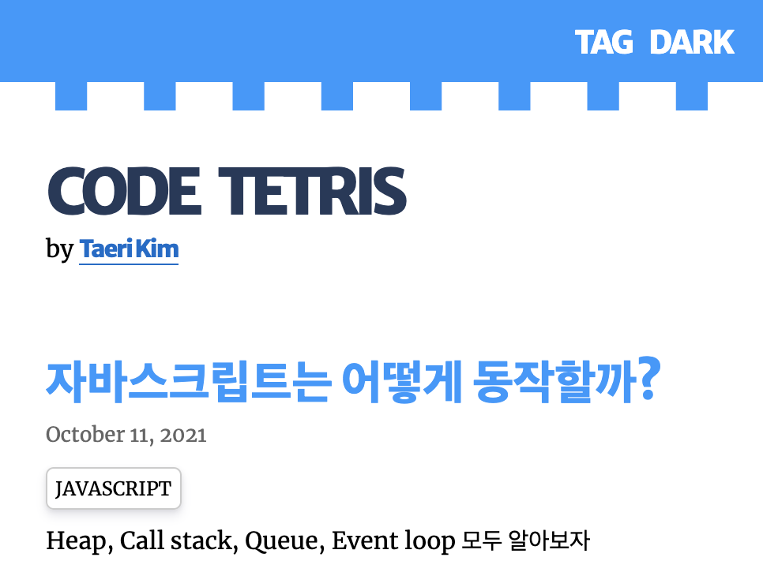
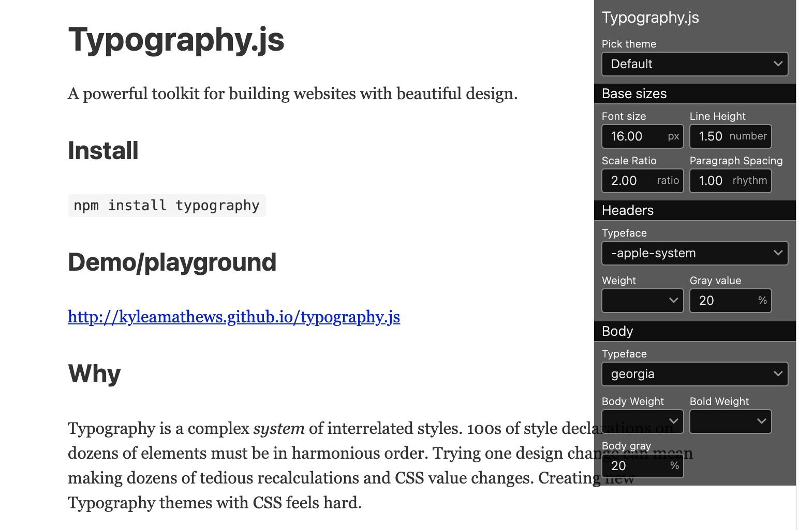
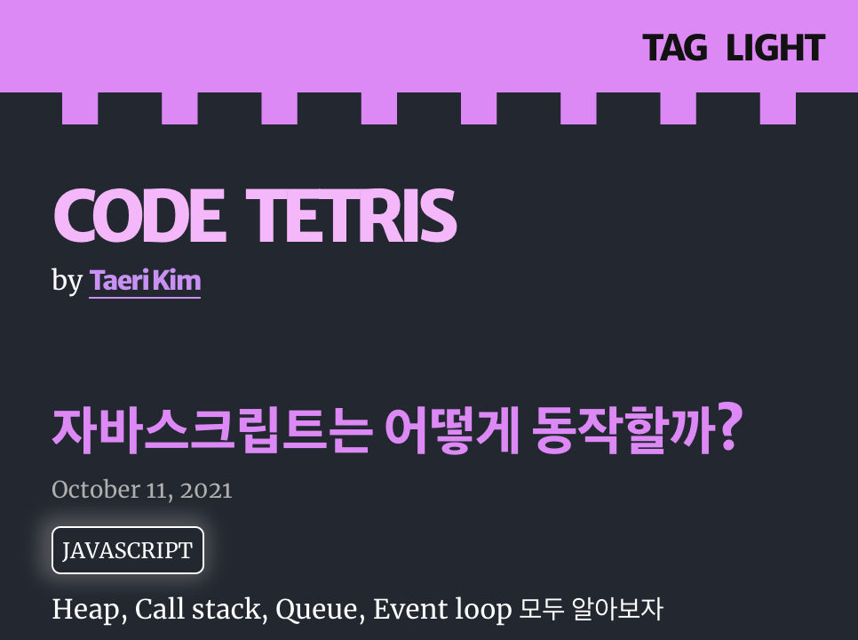
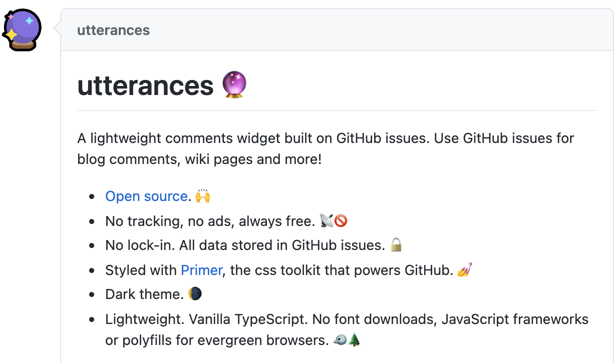

채우는 것 보다 비우는 것이 더 어려운 것입니다. 추상적으로 터득했다고 생각하는 지식도 말이나 글로 표현하려 하면 내 것이 아니었다는 것을 느낄 수 있습니다.  
제가 학습하는 것은 개발입니다. 특정 플랫폼에서 글만 쓰기에는 제 필력은 형편이 없고 머릿속 지식도 난잡합니다. 하지만 무언가 만들어본다는 것에 호기심이 있습니다.  
좀 더 능동적으로 운영해보고 싶었고 그 결과 아주 많은 것을 배울 수 있었습니다.

## Build Tool

블로그를 빌드하기 위해 조금만 찾아봐도 주류로 사용되는 툴은 몇 가지 없다는 것을 알 수 있었습니다.  
[Jekyll](https://jekyllrb.com/)을 사용한 블로그가 많았고 그것은 Ruby를 사용합니다. 손에 익은 **react**를 사용하길 원했습니다. 하지만 조금 더 검색엔진에 노출되기 위해 [CSR](https://developers.google.com/web/updates/2019/02/rendering-on-the-web?hl=ko)이 아닌 방법을 찾고 있었습니다.

### Gatsby.js

React를 핵심으로 한 프레임워크 [Next.js](https://nextjs.org/)와 함께 언급되는 [Gatsby.js](https://www.gatsbyjs.com/) 입니다.  
이 둘의 특징은 react를 사용함에도 클라이언트 사이드 렌더링이 아닙니다.
Gatsby는 빌드 시에 정적 웹사이트로 **미리 렌더링**하므로 **SEO**에 이점이 있습니다.

### Develop

Gatsby는 수많은 **스타터 템플릿**을 지원합니다.  
유려한 디자인과 기능을 갖춘 스타터들은 간단하고 빠르게 목적에 도달할 수 있게 합니다. 하지만 제 취지에 적합하지 않기 때문에 아주 친절한 도큐먼트와 함께 하나하나 구현해보았습니다.  
이미 넓은 커뮤니티가 존재하여 플러그인 또한 방대합니다.

## UI/ Feature

정말 필요한 기능만 남기고 글에 집중할 수 있는 블로그를 구상했습니다.  
pc 와 mobile의 간극이 없는 **심플한 UI**와 원하는 토픽을 찾기 위한 **tag**로 이루어져 있습니다. 전형적인 구성이지만 **depth를 가볍게 하여 사용자 편의성을 고려했습니다.**  
미적 감각과 배포 경험도 현저히 부족하기에 여러 레퍼런스를 찾아 참고를 많이 하였습니다.

### Reference

- [Jbee](https://jbee.io/)
- [rhostem](https://blog.rhostem.com/)
- [Dan Abramov](https://overreacted.io/)

### Typography.js

[Typhography.js](https://github.com/kyleamathews/typography.js/)는 글꼴과 줄 간격 헤더의 크기 등 타이포그래피에 관한 CSS를 일괄 설정할 수 있는 라이브러리입니다.
수많은 theme을 제공하고 커스터마이징이 가능해 시간을 많이 단축하고도 좋은 결과물을 얻을 수 있습니다.

### Dark Mode

이제 웹 트렌드를 떠나 없다면 불편할 정도의 입지를 가지고 있는 **다크모드** 입니다.  
[Gastby plugin](https://www.npmjs.com/package/gatsby-plugin-dark-mode)을 사용해 사용자 web db에 저장되어있는 theme 설정을 가져와 초기화시켜줍니다.

### utterances

**comments 위젯**를 제공하는 [utterances](https://utteranc.es/)는 GitHub **issue search API**를 사용하여 관리합니다. 당연히 github 계정으로 작성할 수 있어서 접근성이 아주 좋습니다.  
오픈소스에 Ads도 없고 미적으로도 만족하였습니다.

## Deploy

첫 배포의 경험은 AWS의 s3와 cloudfront를 사용하여 정적 웹사이트를 배포하는 것이었습니다. **SSL**을 위한 여정은 지금 다시 하려해도 참 골치가 아픕니다.  
**깃헙 페이지**를 간편하게 사용할 수 있었지만 도메인을 따로 설정할 수가 없습니다.

### Netlify

[Netlify](https://www.netlify.com/)는 **정적 웹사이트**를 호스팅할 수 있는 서비스입니다.  
**prerendering**을 지원하기 때문에 Gatsby와 궁합이 좋고 이미 그렇게 사용하시는 분들이 많습니다.  
github repo와 연결해서 push 하면 **자동으로 build** 할 수 있습니다.
몇 번의 클릭으로 **SSL 세팅**이 가능합니다.  
더군다나 **부분적 무료**이니 사용하지 않을 이유를 찾기가 어려웠습니다.

## SEO

이번 기회에 처음 공부하게 되었습니다. 아직 잘 모르지만 비즈니스적인 부분과 처음으로 맞닿으면서 흥미로운 경험이었습니다.

- [GA](https://analytics.google.com) : 유명한 구글 아날리스트입니다. **사용자 유입**을 트레킹해주며 차트와 표로 결과를 알려줍니다. 현재 일반적으로 가이드 되어 있는 방법이 최근 업데이트 이후 변경점이 있습니다.
- robots.txt, sitemap.xml : **검색엔진**을 위한 이정표를 하며 Gatsby plugin으로 자동화 할 수 있습니다.

## RSS

**구독 서비스**를 위하여 RSS 리더가 읽을 수 있는 XML로 파싱합니다. 아직 사용해본 경험이 없습니다.

## Conclusion

처음 구상부터 배포를 완료하기까지 그리고 지금까지도 혼란과 새로움의 연속이었습니다. 사용한 툴들은 도큐먼트가 잘되어 있는 것이 선정에 큰 이유였습니다. 하나하나 새로 배우고 삽질을 해나가면서 부족한 점을 절실히 느낍니다. 제작기 역시 입문자의 상황이 여과 없이 드러나는 것 같습니다.  
지금은 제가 배운 것을 배출하는 과정에서 글쓰기와 정리에 대하여 또 다른 고개를 느끼고 있으며 조금 더 모호하지만 성장을 하는 것 같습니다.  
코 묻은 손으로 꼬질꼬질하게 만들고 쓰고 있는 제 블로그에 **피드백**을 주시면 정말 감사하겠습니다.
