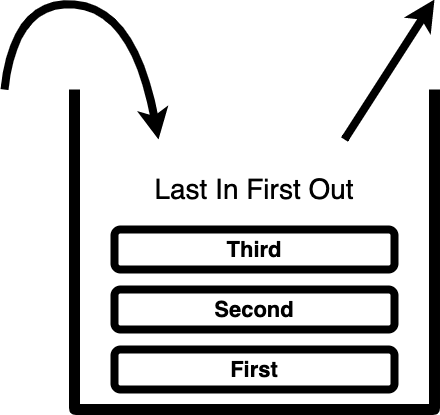

지금까지 자바스크립트의 여러 가지 코어 컨셉에 대하여 알아보았습니다.  
자바스크립트가 싱글 스레드 처리 방식을 가지고 있다는 것은 [비동기]("https://www.codetetris.com/posts/js-asynchronous/")를 다룰 때 알아보았습니다.  
Promise를 사용하여 무거운 task를 다룰 때도 렌더링이 멈추지 않고 잘 작동하게 되었습니다.

> '나 이거 좀 할 줄 아는 거 같아!'

혹시 자바스크립트가 어떻게 동작하는지 아시나요?

```js
const first = () => {
  second()
  Promise.resolve().then(() => console.log("first"))
}
const second = () => {
  third()
  setTimeout(() => console.log("second"), 0)
}
const third = () => {
  console.log("third")
}

first()
```

내가 `setTimeout`도 알고 콜백 함수도 알지만, 위의 결과가 내 예상이 다르다면 자바스크립트에 조금 깊숙한 부분을 알아볼 필요가 있습니다.

## 가상의 내부구조


이해해야 할 3가지 컨셉이 있습니다.

- Heap
- Call Stack
- Callback Queue

### Heap

변수나 객체 같은 참조 타입들이 이곳에 할당 하게 됩니다.

### Call Stack

스크립트에서 호출된 (Call) 코드들이 push되어 쌓입니다. (Stack)  
제일 최근에 push된 코드부터 순서대로 실행 완료되면 pop 됩니다.



이는 개발자 도구에서도 확인 할수 있습니다.


### Callback Queue

런타임에서 작업을 순차적으로 처리하기 위한 대기실입니다.  
Queue는 **First-In-First-Out**의 선형자료구조를 뜻합니다.

## Event Loop

여기 Event loop에 대하여 쉽게 이해할 수 있는 웹앱이 있습니다.
http://latentflip.com/loupe


Event loop은 Queue를 주시하고 있습니다.  
call stack 안에 task가 모두 실행되어 비어있을 때 Queue에 대기하고 있던 함수들이 순차적으로 push 합니다.

## Queue 하위 구조

Queue는 내부적으로 Task Queue, Microtask Queue가 있습니다. Animation Frames 등으로 더 세부적으로 나뉘는 경우도 있습니다만 아직 다루지 못해 서술하지 않습니다.

```js
const first = () => {
  second()
  Promise.resolve().then(() => console.log("first"))
}
const second = () => {
  third()
  setTimeout(() => console.log("second"), 0)
}
const third = () => {
  console.log("third")
}

first()
```

콘솔에서 'second'가 먼저 찍히는 것을 예상했지만 'first'가 먼저 나오는 이유는 Queue의 처리 순서에서 알 수 있습니다.

### Task Queue

- setTimeout
- setInterval
- setImmediate
- requestAnimationFrame
- etc..

`setTimeout`이나 `setInterval`등이 Task Queue로 콜백을 보내주는 대표적인 API들 입니다.

### Microtask Queue

- Promise
- process.nextTick
- Object.observe
- MutationObserver

**Promise**는 Microtask Queue로 콜백을 보내는 대표적인 API 입니다.

Queue 선입선출 구조지만 Task Queue 보다 Microtask Queue의 task가 먼저 out 됩니다.
