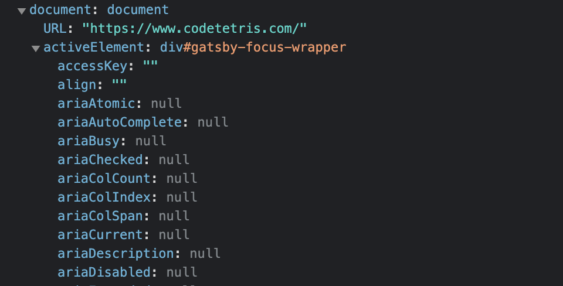
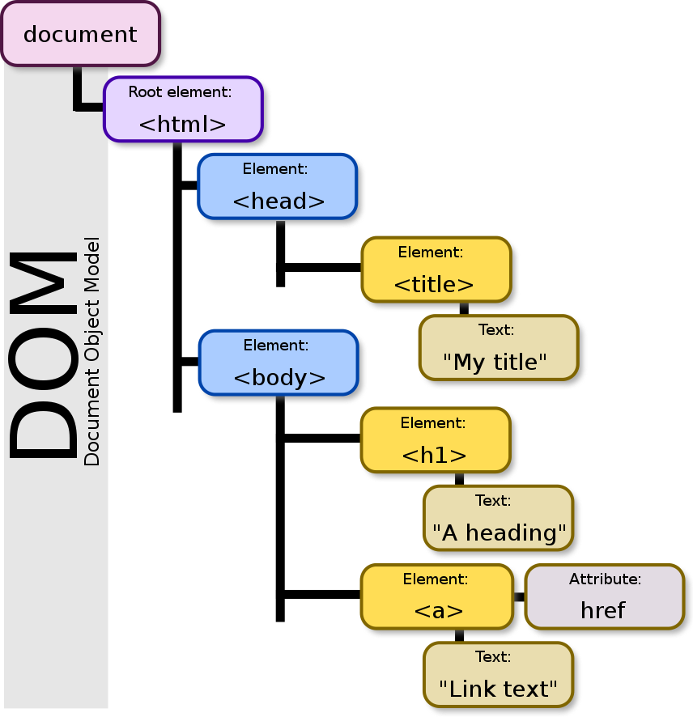
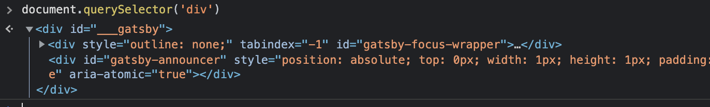
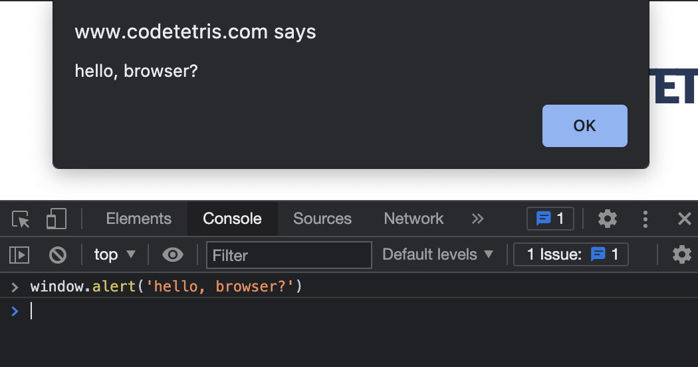
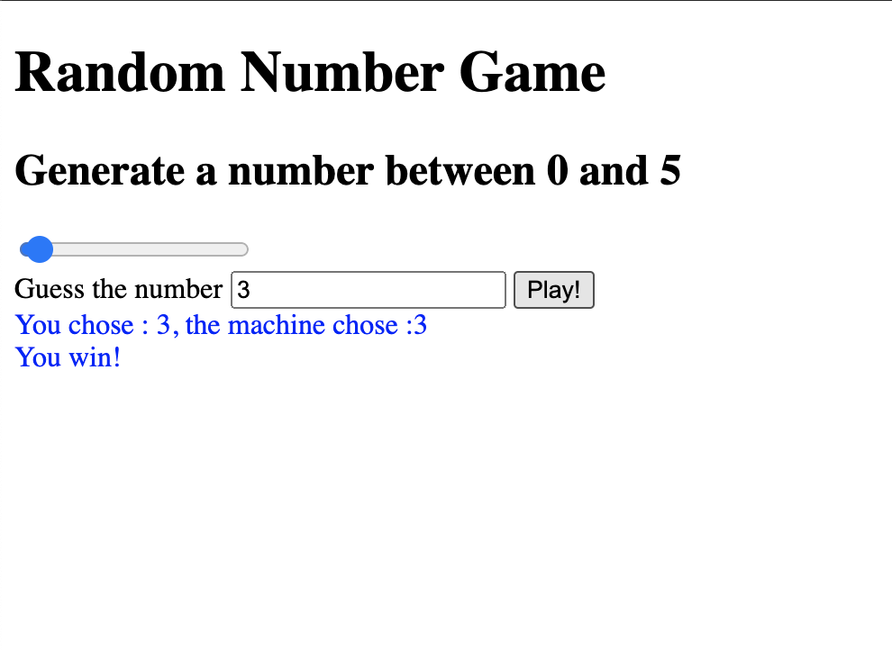

처음 자바스크립트에 입문하던 날로 돌아가 봅시다.  
제일 인상 깊었던 것은 변수를 선언하고 그곳에 `document.querySelector('....')` 라는 이상한 문장을 할당하니 **HTML tag**가 나오는 것이었습니다.  
이후 이벤트 리스너, `appendChild()` 같은 여러 가지 API를 배우면서 당연하다는 듯, 마치 주문이라도 외워서 된 마냥 사용해 왔습니다.  
그런데 HTML이 어떻게 메소드를 사용하여 return이 가능할까요?  
정말 무시무시한 일이 아닐 수가 없습니다.

## 전역 객체 window

browser 상의 **전역객체**인 `window`를 확인해봅시다.

개발자 콘솔에서 `window`를 확인하면 수많은 프로퍼티 중에 `document`를 확인할 수 있습니다.  
`document`는 **객체**이며 그것은 자바스크립트를 호출한 HTML을 객체로 표현한 것을 알 수 있습니다.

## Document Object Model (DOM)

**Document Object Model**(DOM)은 웹 페이지의 콘텐츠를 객체로 표현합니다.



`document` 객체는 **이정표** 역활을 합니다. 해당 객체를 통해 자바스크립트에서 HTML을 읽고 수정할수 있습니다.

### Element

DOM API에 의해서 return된 **nodes**, 쉽게 말해 서론에 작성된 HTML tag를 의미합니다.

개발자 콘솔에서 마치 HTML 같이 표현을 했지만 이것도 당연히 **객체**입니다.

### 모두의 DOM

**DOM의 개념은 오직 자바스크립트의 것이 아닙니다.** 다른 어떠한 언어 혹은 browser가 아닌 곳에서도 `document`에 접근하기 위해 사용됩니다.

## Browser Object Model (BOM)

**Browser Object Model** (BOM)은 browser가 제공하는 추가 객체를 나타냅니다.

호스트 환경이 browser일 때 `document` 이외의 다른 것을 제어하기 위해 사용됩니다.
흔히 알고 있는 `alert`, `confirm`, `prompt`, `location` 같은 다양한 API들이 이곳에 속합니다.

## DOM API

DOM API는 동적으로 상호작용하는 다양한 기능을 합니다.

```js
const generate = document.querySelector(".js-generate")
const range = document.querySelector(".js-range")
const jsValue = document.querySelector(".js-value")
const button = document.querySelector(".js-button")
const result = document.querySelector(".js-result")

function handleRangeChange(event) {
  const numberValue = event.target.value
  generate.innerText = `Generate a number between 0 and ${numberValue}`
}

function getRandom() {
  const number = Math.floor(Math.random() * range.value)
  return number
}

function getResult(value, random) {
  setTimeout(() => (result.style.color = ""), 1000)
  if (value === random) {
    result.style.color = "blue"
    return "You win!"
  } else {
    result.style.color = "red"
    return "You lose!"
  }
}

function handleButton() {
  const inputValue = parseInt(jsValue.value)
  const randomNumber = getRandom()
  if (inputValue !== null) {
    result.innerText = `You chose : ${inputValue}, the machine chose :${randomNumber}
        ${getResult(inputValue, randomNumber)}`
  }
}

range.addEventListener("input", handleRangeChange)
button.addEventListener("click", handleButton)
```

range type input의 value와 random number가 같다면 파란색의 You win!  
다르다면 빨간색 You lose! 가 화면에 나타나는 예제입니다.



- `document.querySelector()` : document 내에서 주어진 선택자를 만족하는 첫 번째 Element를 반환합니다.
- `element.addEventListener()` : 이벤트 처리기를 Element의 특정 이벤트 유형에 등록합니다.
- `element.innerText` : Element의 렌더링 된 텍스트 콘텐츠를 나타냅니다.
- `element.style` : 속성에 직접 문자열을 할당하여 인라인 스타일을 설정할 수 있습니다.

하나씩 열거할 수 없을 만큼 많고 깊은 내용을 담고 있습니다.  
DOM의 명세는 https://dom.spec.whatwg.org/ 에서 확인할 수 있지만 보다시피 아주 무섭게 생겼습니다.  
이럴 땐 역시 [MDN](https://developer.mozilla.org/ko/docs/Web/API/Document_Object_Model)에서 확인해 봅시다.
