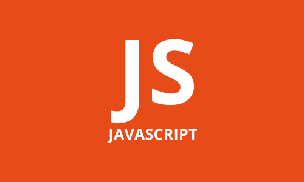

## 자바스크립트란?

자바스크립트는 **객체 기반의 스크립트 언어** 입니다. 웹 브라우저에서 자바스크립트를 해석합니다. 브라우저를 벗어나 보통 서버에서 사용되는 [Node js](https://nodejs.org/ko/)가 있습니다.  
예로 **[DOM](https://developer.mozilla.org/ko/docs/Web/API/Document_Object_Model/Introduction)( Document Object Model )API**로 HTML과
CSS를 수정할 수 있고 이 결과 다이나믹한 요소을 구현할 수 있습니다.

## 탄생

기술의 탄생과 발전은 불편함을 개선하고자 에서 시작 되었다고 할 수 있습니다. 90년대 초 HTML와 CSS로 만들어진 사이트에서 동적인 부분을 추가하고 싶어 하는 갈망이 생겨납니다.  
당시 마이크로소프트와 경쟁을 하던 **Netscape**사에서 자바스크립트의 아버지 [Brendan Eich](https://ko.wikipedia.org/wiki/%EB%B8%8C%EB%A0%8C%EB%8D%98_%EC%95%84%EC%9D%B4%ED%81%AC)를 영입하여 만들어진 Mocha, 공식적으로는 LiveScript는 그 당시 각광받고 았던 Java와 비슷한 문법을 채택하여 탄생합니다.
1995년 12월 **JavaScript**로 이름이 바뀌어 지금까지 그렇게 불려지고 있습니다.

### Java? JavaScript?

지금까지도 많은 개발자들이 사용하는 두 언어인 만큼 입문하는 단계에서 혼동되는 부분입니다. 당시 자바의 인기에 편승하기 위함에 네이밍을 저렇게 했다는데 세상에...  
 결론만 말하자면 아예 **다른 언어**입니다.

## 고통받는 개발자

> 어디서부터 잘못됐을까...

2000년대 초 인터넷 시장 규모가 커져가면서 다양한 브라우저들이 생겨났습니다. 개발자들은 각자 다른 기능에 맞춰 개발을 해야 했고 각 사이트별로 선호하는 브라우저들이 달랐습니다. [도저히 죽지 않는 IE](https://www.youtube.com/watch?v=r1zw_eM2aiQ)때문에 여전히 고통받곤 있지만 당시 그런 문제를 해결하고자 **JavaScript을 표준화한 ECMAScript** 가 생겨나고 이것이 발전하여 현재 사용되고 있는 문법이 채택된 **[ECMAScript 6](https://262.ecma-international.org/6.0/) (ES6)** 가 2015년에 출판 되었습니다.

## 돌이켜보면

HTML과 CSS는 배울 땐 재밌었습니다. 다들 자바스크립트를 해야 한다 라고 해서 시작했지만 '요소는 엄청 깨알 같은데 어렵긴 엄청 어렵네' 라는 게 첫인상이였던 것 같습니다. (지금은 CSS가 더 골치 아프고..)  
**접근성은 확실히 좋습니다.** 개인적으로는 처음에 입문할 땐 결과물이 시각적으로 보이는 것이 흥미를 유발합니다. 보통 **Java**로 하는 백앤드 커리큘럼은 적성에 따라 다르지만 막연하게 느낄 수도 있습니다. **커뮤니티나 강의도 굉장히 많습니다.** 그만큼 **변동성이 많은 곳**이기도 해서 새로운 것에 대한 습득력도 비교적 더 필요한 거 같습니다.

## 결론

앞으로 JavaScript 의 **ES6 문법**으로 포스팅이 진행될 거 같습니다.
흔히들 하는 표현이지만 웹에 생명을 불어넣는 과정이라고 생각합니다.
가볍고 유연한 언어지만 단점이 될 때도 있습니다.  
하나씩 정리하면서 어떻게 써먹어야 할지 같이 고민하는 시간이 되었으면 좋겠습니다.

### 참조

- [위키백과: 자바스크립트](https://ko.wikipedia.org/wiki/%EC%9E%90%EB%B0%94%EC%8A%A4%ED%81%AC%EB%A6%BD%ED%8A%B8#HTML%EA%B3%BC_%EC%9E%90%EB%B0%94%EC%8A%A4%ED%81%AC%EB%A6%BD%ED%8A%B8)
- [MDN: JavaScript가 뭔가요?](https://developer.mozilla.org/ko/docs/Learn/JavaScript/First_steps/What_is_JavaScript)
- [드림코딩 by 엘리: 자바스크립트의 역사와 현재 그리고 미래](https://www.youtube.com/watch?v=wcsVjmHrUQg&t=1s)
