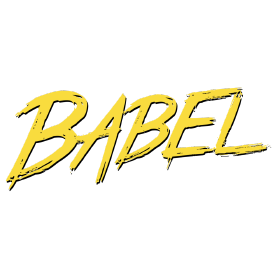

[Webpack](https://webpack.js.org/)을 처음 접한 것이 아마 React를 시작했을 때였습니다.  
[CRA](https://github.com/facebook/create-react-app)로 상 다 차려 주면 떠먹을 줄만 알았던 그땐 (물론 지금도) 안 보였던 것들이 Vanila JS에 [Gulp](https://gulpjs.com/)를 세팅해보면서 조금씩 보이기 시작했습니다.  
Webpack이나 Gulp나 결국은 우리의 환경과 문제점을 개선하기 위함인건 틀림없기에 그 의도가 나의 상황과 맞아떨어졌을 때 더욱 크게 다가옵니다.

## Webpack


```
npm install webpack webpack-cli --save-dev
```

Webpack에서는 현대 자바스크립트를 위한 **Static Module Bundler**
라고 소개하고 있습니다.

Module Bundler는 **모듈**들을 묶어서 하나의 **번들**로 만들어주는 기능을 합니다.

자바스크립트를 할 때 코드량이 많아지면 보통 스크립트 파일을 기능별로
쪼개는 방식을 흔히 볼 수 있습니다. 하지만 규모가 커질수록 요청을 해야하는 스크립트들이 많아지면 성능적으로 손실을 많이 가져올 수 있으며 변수들끼리 충돌을 야기할 수 있습니다.

이러한 자바스크립트의 모듈들을 하나의 자바스크립트 파일로 만들어주는 역활을 수행하는 것이 Webpack의 큰 비중을 가진다고 볼 수 있습니다.

## Wabpack 5가지 코어 컨셉

### Entry

**종속성 그래프**를 만들기 위해 필요한 **진입점**입니다.  
진입점을 기준으로 각 모듈의 의존성을 파악해서 그래프를 생성합니다.  
디폴트는 `./src/index.js`로 설정됩니다.

```js
module.exports = {
  entry: "./entryfile.js",
}
```

### Output

번들링 된 파일을 어디에 어떤 이름으로 저장할지 설정합니다.
디폴트는 `./dist/main.js`로 설정됩니다.

```js
module.exports = {
  output: {
    filename: "bundle.js",
    path: ".dist",
  },
}
```

### Loader

Wabpack은 기본적으로 자바스크립트와 JSON 파일만 이해합니다.
하지만 우라가 원하는 것은 이미지, 폰트, 스타일시트까지 전부 번들링 하길 원하기 때문에 Wabpack이 이해하게 하려고 **Loader**를 사용합니다.

```
npm i css-loader --save-dev
```

```js
module.exports = {
  module: {
    rules: [
      {
        test: /\.css$/,
        use: ["css-loader"],
      },
    ],
  },
}
```

### Plugin

번들링된 **결과물**에 원하는 작업을 처리합니다.

```
npm install html-webpack-plugin clean-webpack-plugin --save-dev

```

```js
const { CleanWebpackPlugin } = require("clean-webpack-plugin")
const HtmlWebpackPlugin = require("html-webpack-plugin")
const webpack = require("webpack")

module.exports = {
  plugins: [
    new webpack.ProgressPlugin(),
    //웹팩의 빌드 진행율을 표시해주는 플러그인
    new CleanWebpackPlugin(),
    //빌드 폴더를 제거/정리하는 웹팩 플러그인
    new HtmlWebpackPlugin({ template: "./src/index.html" }),
    //웹팩으로 빌드한 결과물로 HTML 파일을 생성해주는 플러그인
  ],
}
```

### Mode

현재 환경에 따라 **Mode**를 설정하여 변경되게 할 수 있습니다.  
디폴트는 **production**으로 설정됩니다.

```js
module.exports = {
  mode: "production",
}
```

### Gulp랑 뭐가 다른가요?

Gulp는 오로지 리소스들에 대한 툴로 사용됩니다. 마찬가지로 번들링을 지원하지만 간단한 프로젝트에서 더욱 유용합니다
프로젝트가 복잡해질수록 리소스들을 의존성 관계에 따라 존속성 그래프를 생성하는 Webpack을 사용합니다.

## Babel



**JavaScript compiler**라고 소개하는 Babel은 쉽게 말해 개발할 때 **ES6** 이상의 코드로 작성하고 여러 브라우저에서 이해할 수 있도록 **ES5**의 코드로 컴파일 하는 역활을 하고 있습니다.

```
npm install --save-dev babel-loader @babel/core @babel/preset-env
```

```js
module.exports = {
  module: {
    rules: [
      {
        test: /\.m?js$/,
        exclude: /(node_modules|bower_components)/,
        use: {
          loader: "babel-loader",
          options: {
            presets: ["@babel/preset-env"],
          },
        },
      },
    ],
  },
}
```

## Polyfill

Babel은 ES6 이상에서 지원하는 문법을 ES5로 트렌스파일 해주지만 ES5에 존재하지 않는 ES6의 존재하지 않는 문법을 메우기 위해 **polyfill**을 사용합니다.

```
npm install --save @babel/polyfill
```

```js
module.exports = {
  entry: ["@babel/polyfill", "./app/js"],
}
```

## 참조

[Webpack](https://webpack.js.org/)  
[Webpack HandBook (KO)](https://joshua1988.github.io/webpack-guide/)  
[Babel](https://babeljs.io/)
