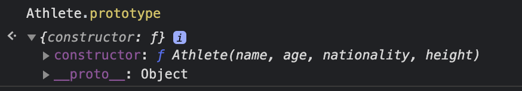
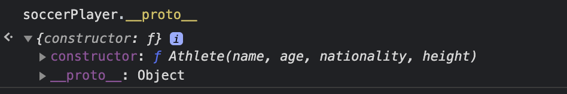

실생활에서 우리는 수많은 다양성을 지닌 채 생활하고 있습니다.  
각자의 이름, 나이, 성별 같은 단순한 정보부터 자신만의 키워드, 직업, 취미들과 같이 많은 정보를 가지고 있습니다.  
이것들을 단순히 배열한다면 가독성도 떨어지고 원하는 값에 도달하기 어려울 것입니다.  
분산되어 일일이 찾기보단 홍길동의 나이라고 했을 때 바로 값을 얻는 것 그것을 안다면 많은 시간과 수고를 덜 수 있을 것 입니다.

## 객체

객체는 원시형(문자형, 숫자형 등)과 달리 다양한 데이터를 담을 수 있습니다.  
고객의 이름, 성별, 나이, 구독 정보를 저장한다고 가정해보겠습니다.

```js
const customer1 = {
  name: "taeri",
  gender: "male",
  age: 25,
  subscription: {
    email: false,
    text: false,
  },
}
```

관련된 데이터들을 모아 더욱 이해하기 쉬워 보입니다.

```js
customer1.name //taeri
customer1["gender"] // male
customer1.age // 25
customer1.subscription.email //false

customer1.subscription.text = true
customer1.subscription.text // true
```

`obj.key` 와 같이 값에 접근하는 방식을 **점 표기법**이라고 합니다.  
`obj['key']`처럼 값에 접근하는 방식을 **괄호 표기법**이라고 합니다.

재할당하여 값을 수정할 수 있습니다.
하지만 분명 객체가 `const`로 선언되어 있는데 어떻게 수정이 가능할까요?

### 상수로 선언된 객체는 수정이 가능합니다.

객체를 변수에 선언할 때 객체 자체가 아닌 **참조 값**을 할당하게 됩니다.  
비유하자면 객체가 담겨있는 보관함의 열쇠를 가지고 있다고 할 수 있습니다.

```js
let a = {}
let b = {}

let c = a

a === b //false
a === c //true
```

불필요한 정보들을 제외하고 공통된 의도에 맞는 것만 남기는 것을 **추상화**라고 합니다.  
이는 JAVA나 C# 등과 같은 **객체 지향 언어**들의 특징 중의 하나입니다.  
객체 지향 프로그래밍을 공부하라는 키워드를 많이 보셨을 겁니다.

## 객체 지향?

처음 설명한 예제처럼 객체의 이점을 이용한 프로그래밍입니다.

물론 객체 지향만이 정답은 아닙니다. 객체 간의 의존성이 심하여 복잡도가 상당히 높습니다.
react도 react hooks를 추가하여 함수 컴포넌트의 장점을 가져오는 등의 변화는 항상 있을 것입니다.
하지만 많은 코드가 이러한 방법으로 작성되어 있고 이해하고 사용할 줄 안다면 더 많은 것을 담을 수 있는 개발자가 될 것입니다.


> 왜 배움에는 끝이 없을까요

객체는 관련된 데이터와 기능들을 외부에서 간섭하지 못하게 묶습니다.  
또한 비슷한 용도로 작은 부분만 수정해서 사용하고 싶을 경우에도 부모 객체를 상속받아 재사용에도 용이합니다.  
운동선수라는 객체를 농구선수 혹은 축구선수의 객체들로 재구성 될때도 활용할 수 있겠습니다.

## 생성자 함수

객체는 일반적으로 {}를 사용하여 만들었지만 유사한 객체를 여러 개 만들 때는 생산자 함수를 사용하면 더욱 간편하게 사용할 수 있습니다.

```js
function Athlete(name, age, nationality, height) {
  this.name = name
  this.age = age
  this.nationality = nationality
  this.height = height
  this.getFt = function () {
    return this.height * 3.28
  }
}

let soccerPlayer = new Athlete("jack", 23, "france", 1.81)
let basketballPlayer = new Athlete("john", 21, "USA", 1.92)

soccerPlayer.name //jack
basketballPlayer.getFt() //6.297599999999999
```

- 함수의 이름 첫 글자는 대문자로 만듭니다.
- `new`연산자를 사용하고 함수를 실행합니다.
- 함수를 실행하면 `this`라는 빈 객체를 만듭니다.
- 본문을 실행하고 `this`를 `return` 합니다.

### 메서드

위의 예제 속 `basketballPlayer.getFt()`에 주의해봅시다.  
객체 속의 함수를 실행 시켜 고유의 값을 얻었습니다.  
이러한 객체 프로퍼티에 할당된 함수를 **메서드(method)** 라고 합니다.

### this

전역에서 `this`는 전역 객체를 참조합니다.

```js
this === window // true
```

브라우저에서 `window`가 전역 객체이기 때문에 `true`가 반환됩니다.  
(Node 환경에서는 `global` 이 전역 객체가 됩니다. )

```js
function GetThis() {
  this.method = function () {
    return this
  }
}

let obj = new GetThis()

obj.method() //GetThis {method: ƒ}
```

메서드 내부에서 `this`는 메소드가 호출될 때 속한 객체를 가르킵니다.

## 프로토타입 상속

자바스크립트는 다른 객체 지향 언어들이 가지고 있는 `Class`가 없습니다.
대신 프로토타입이라는 독특한 개념으로 비슷하게 사용하고 있습니다.

```js
let obj = new Object()
```

생성자 함수로 객체를 만드는 법은 이미 알고 있습니다. 그 속에선 어떤 일이 일어나고 있을까요?

- 함수에 `Constructor`가 부여됩니다.
- 함수를 정의하면 `Prototype`이라는 빈 객체가 생성됩니다.

```js
function Athlete(name, age, nationality, height) {
  this.name = name
  this.age = age
  this.nationality = nationality
  this.height = height
  this.getFt = function () {
    return this.height * 3.28
  }
}

Athlete.prototype // 아래 이미지 참조
```



객체에 `prototype` 속성을 사용해 접근할 수 있습니다.
해당 `prototype`엔 두 가지 속성이 존재합니다.

- `constructor`는 참조하는 함수가 됩니다.
- `__proto__`는 상속받는 부모 함수의 `prototype` 객체를 가르킵니다.

그렇다면 우리는 위에 예제로 돌아가 확인해볼 것이 있습니다.

```js
function Athlete(name, age, nationality, height) {
  this.name = name
  this.age = age
  this.nationality = nationality
  this.height = height
  this.getFt = function () {
    return this.height * 3.28
  }
}

let soccerPlayer = new Athlete("jack", 23, "france", 1.81)

soccerPlayer.__proto__ // 아래 이미지 참조
```



상속받았던 부모 객체의 프로토타입인 `Athlete.prototype`와 같은 것을 알 수 있습니다.

```js
Athlete.prototype.greeting = function () {
  return `Hello, I'm ${this.name}`
}

soccerPlayer.greeting() //"Hello, I'm jack"
```

`prototype` 객체에 메서드를 추가하는 것은 자연스러운 일이지만 생성된 객체가 어떻게 바로 사용할 수 있을까요?

바로 **프로토타입 체인** 으로 상속된 객체들끼리 묶여있기 때문입니다.
객체 자신의 프로퍼티 중에 해당 메서드가 있는지 확인한 후 없다면
`__proto__` 프로퍼티를 이용하여 부모 객체로 이동하여 확인 후 존재하면 실행하고 없다면 이를 반복해 최상위 객체인 `Object`의 `prototype` 객체의 프로퍼티에서도 찾을 수 없다면 `undefined`를 반환합니다.

이를 통해 우리가 평소에 `toString` 같은 메서드나 `String` 객체의 `slice` 메소드를 바로 사용할 수 있는 이유를 알 수 있습니다.

## Class

자바스크립트에서 `Class`는 함수의 한 종류입니다.

```js
class Athlete {
  constructor(name, age, nationality, height) {
    this.name = name
    this.age = age
    this.nationality = nationality
    this.height = height
  }

  getFt() {
    return this.height * 3.28
  }
}
```

위 코드의 작동 원리는 다음과 같습니다.

```js
function Athlete(name, age, nationality, height) {}
```

- 동일한 이름의 함수가 생성됩니다.

```js
function Athlete(name, age, nationality, height) {
  this.name = name
  this.age = age
  this.nationality = nationality
  this.height = height
}
```

- 함수 본문에는 `constructor`로 채워집니다.

```js
function Athlete(name, age, nationality, height) {
  this.name = name
  this.age = age
  this.nationality = nationality
  this.height = height
}

Athlete.prototype.getFt = function () {
  return this.height * 3.28
}
```

- 정의한 메서드를 `prototype` 객체에 저장합니다.

단순히 가독성을 위한 문법이냐고 반문할 수 있지만, `Class`만의 특징이 있습니다.

- `Class`는 자동으로 엄격 모드가 적용됩니다.

- 메서드를 열거할 수 없습니다.

- 함수 선언문과 달리 호이스팅 되지 않습니다.

### static

`class`에서 `static` 키워드를 사용하면 `prototype`에서 공유하지 않는 정적인 프로퍼티를 생성할 수 있습니다.

```js
class Athlete {
  constructor(name, age, nationality, height) {
    this.name = name
    this.age = age
    this.nationality = nationality
    this.height = height
  }

  static sponsor = "nike"
}

let soccerPlayer = new Athlete("jack", 23, "france", 1.81)

Athlete.sponsor // nike

soccerPlayer.sponsor // undefined
```

### extends

`extends` 키워드는 다른 클래스의 자식 클래스를 생성하기 위해 사용됩니다.

```js
class Athlete {
  constructor(name) {
    this.name = name
  }
}
class SoccerPlayer extends Athlete {
  constructor(name, position) {
    super(name)
    this.position = position
  }
  bio() {
    return `${this.name} : ${this.position}`
  }
}

let player1 = new SoccerPlayer("sam", "keeper")

player1.bio() //sam : keeper
```

상대 `class`에 `constructor`가 있다면 `super()`를 호출해야 합니다.
