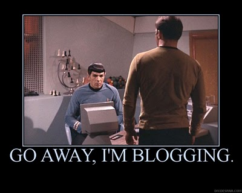

작년 이맘때부터 새로운 것을 시도해보아야겠다는 생각을 했던 거 같습니다.
**FE 개발자**라는 것에 매력을 느껴 지금까지 공부를 해오면서 수많은 정보를 머릿속에 주입했습니다. 하지만 그것이 온전히 내 것이 아니었고 시간이 지나면서 이것을 정리해야 할 필요성을 느꼈습니다.  
**그래서 준비한 것이 바로...**

## 블로그

명목은 블로그지만 피드백을 주고받을 정리 노트가 필요했습니다. (독학은 정말 고독합니다.)  
정적 사이트를 위해 **React, Gatsby JS, Netlify**를 사용하였습니다.
이것을 JAM stack이라고 한다던데 추후 제작기를 포스팅하도록 하겠습니다.

## 토픽

주로 **JavaScript**에 관련하여 포스팅을 해나갈 것 같습니다.

- ES6 문법
- 입문적인 Git이나 CLI
- 반응형 CSS
- React

정도만 해도 꽤 꾸준히 해야 가능하겠네요.

## 결론

갈 길이 아득합니다. 다크 모드 테마도 고려해야 하고 처음 배포한 결과물이라 문제가 많겠지만 큰 부담은 없습니다.  
다른 곳에서 다 얻을 수 있는 정보이고 심지어 잘못된 것도 많겠지만 다들 처음에 맨땅에 헤딩 한 번씩 해야 또 성장하지 않겠습니까?  
무조건 편하게 의견 나눠주시길 부탁드립니다.
