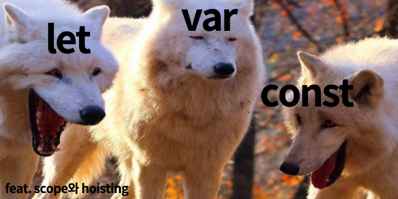

**변수**(variable)'은 value를 저장할 때 쓰이는 이름표입니다.
정리를 할 때 상자에 이름을 적고(**선언**) 그 안에 내용물을 담는다(**할당**)고 비유하는 경우가 많습니다.

## let

let을 이용하여 변수를 생성한다는 건 이름이 정해진 상자의 내용물이 바뀌어도 계속 사용 할 수 있다고 할 수 있습니다.

```js
let name // 선언
name = "taeri" // 할당

console.log(name) // "taeri"
```

"taeri" 라는 값이 변수와 연결된 메모리 영역에 저장되었기 때문에, 변수명(name)을 이용해 값에 접근할 수 있습니다.

```javascript
let name = "taeri"
name = "code tetris"

console.log(name) // "code tetris"
```

값이 변경되면, 이전 데이터는 변수에서 제거됩니다.

```js
let name = "taeri"
let name = "code tetris" // Uncaught SyntaxError: Identifier 'name' has already been declared

console.log(name)
```

같은 변수를 두 번 선언하면 에러가 발생합니다.

### 스코프

쉽게 얘기하자면 참조 할 수 있는 범위입니다.
**전역 스코프**(Global Scope)는 전역에 선언되어있어 어느 곳에서든지 해당 변수를 참조 할 수 있습니다.
**지역 스코프**(Local Scope)는 해당 코드 블록이나 함수 내에서 참조할 수 있습니다.
하위 스코프는 상위 스코프에 접근할 수 있지만 반대는 불가합니다.

```js
let variable = "global"

function test() {
  let variable = "local"
}

console.log(variable) // "global"
```

## var

var로 선언한 변수의 스코프는 **함수 스코프**(지역 스코프)이거나 **전역 스코프**입니다. 블록 기준으로 스코프가 생기지 않기 때문에 블록 밖에서 접근 가능합니다.

### 선언 후 다시 선언이 가능

```js
var user = "Mr.A"

var user = "Mr.B"

console.log(user) // "Mr.B"
```

### 심지어 선언하기도 전에 사용이 가능

```js
function user() {
  name = "Mr.A"

  console.log(name)

  var name
}
user() //"Mr.A"
```

var는 함수 내에서 선언되지 않았다면 스크립트가 시작될 때 정의됩니다.  
함수 내에서 var는 선언 위치와 상관없이 함수가 시작되는 지점에서 정의됩니다.  
(변수가 중첩 함수 내에서 정의되지 않아야 합니다).

변수가 끌어올려 지는 것을 **호이스팅**(hoisting)이라고 부릅니다.
선언은 호이스팅 되지만 할당은 호이스팅 되지 않습니다.

### let vs var


es6에서 let이 나온 이후 var는 거의 사용되지 않고 있습니다. 하지만 그 이전에 작성된 코드를 봐야 할 일이 아직은 꼭 생길 테고 어느 정도 이해를 하고 것이 도움이 됩니다.

## const

**변화하지 않는 변수**를 선언할 땐, const를 사용합니다.
const는 재할당할 수 없으므로 변경하려고 하면 에러가 발생합니다.

```js
const name = "taeri"

name = "Mr.A" // Uncaught TypeError: Assignment to constant variable.

console.log(name)
```

의도하지 않은 값이 변경되는 것은 여러 사람과 같이 일을 할때 예상치 못한 에러를 만들기 때문에 **변숫값이 절대 변경되지 않을 것**이라 확신하면 const를 이용해 선언해 줍니다.

### 변수 명명 규칙

- 변수명에는 오직 **문자와 숫자**, 그리고 **기호 $와 \_만** 들어갈 수 있습니다.

- 첫 글자는 숫자가 될 수 없습니다.

- [예약 키워드 목록](https://developer.mozilla.org/ko/docs/Web/JavaScript/Reference/Lexical_grammar)에 있는 단어는 사용할 수 없습니다.

## 효율적인 변수명

변수명을 만들 땐 [카멜 표기법(camelCase)](https://zetawiki.com/wiki/%EC%B9%B4%EB%A9%9C%ED%91%9C%EA%B8%B0%EB%B2%95_camelCase,_%ED%8C%8C%EC%8A%A4%EC%B9%BC%ED%91%9C%EA%B8%B0%EB%B2%95_PascalCase)가 흔히 사용됩니다. 카멜 표기법은 단어를 차례대로 나열하면서 첫 단어를 제외한 각 단어의 첫 글자를 대문자로 작성합니다.

변수명은 변수가 담고 있는 것이 무엇인지 쉽게 알 수 있도록 지어져야 합니다.
하나의 목적으로만 사용될 수 있는 이름이어야 합니다. 대충 만든 변수명 `x, a, item ...`을 누군가 혹은 언젠간 본인도 기억이 나질 않아 무엇인지 알아내기 위해 시간을 낭비하고 있습니다.

개인적으로도 굉장히 모호하고 신경이 쓰이는 부분입니다. 유명 레포들과 여러 레퍼런스를 뜯어보고 비교하면서 스스로 느끼고 계속해서 고민해야 할 것 같습니다.

### 참조

- [Javascript.Info : 변수와 상수 ](https://ko.javascript.info/variables)
